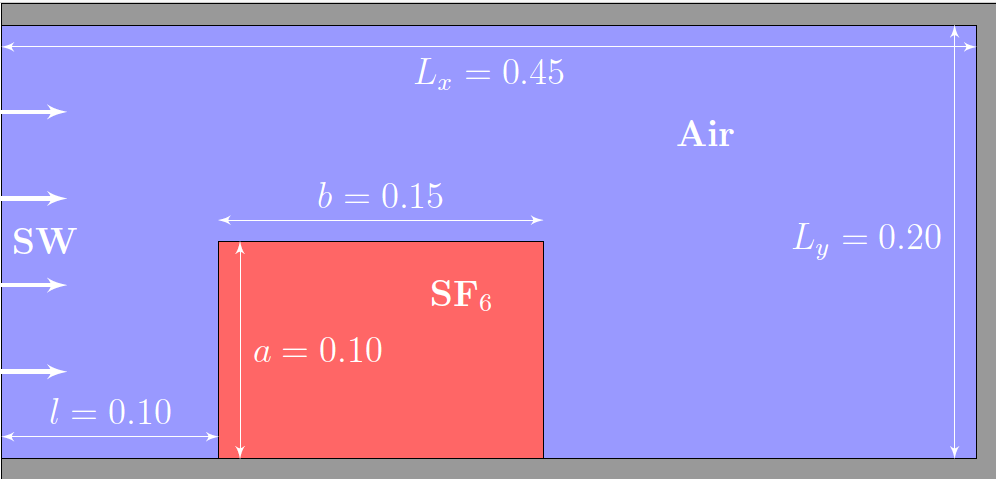

# Задача о набегании ударной волны на прямоугольную область с тяжелым газом

## Описание задачи

Рассматривается задача о развитии неустойчивости Рихтмайера-Мешкова при прохождении ударной волны через примыкающую к стенке прямоугольную неоднородность из тяжелого газа [1,2].

## Постановка задачи

_Рисунок 1 - Геометрия расчетной области_

Расчетная область - прямоугольная $[0, L_x]\times[0, L_y] = [0, 0.45]\times[0, 0.2]$, изображена на рисунке~1. В начальный момент времени в прямоугольной подобласти $[0.1, 0.25]\times[0, 0.1] $ (подобласть II на рисунке 1) находится покоящийся тяжелый газ – фторид серы VI ($SF_6$, элегаз) в остальной части находится покоящийся воздух (подобласть I на рисунке 1). В начальный момент времени оба газа находятся в статическом равновесии. На левой грани задается условие входа ударной волны, на остальных гранях – адиабатические стенки с проскальзыванием. Параметры сред, принятые для вычислительного эксперимента указаны в таблице 1}.

## Результаты экспериментов

В натурном эксперименте [1] в ударной трубе создается плоская ударная волна (УВ) с числом Маха 1.26. УВ движется в зоне наблюдения с прозрачными стенками, состоящей из двух областей (см. рис. 1): одна заполнена воздухом, а блок высотой $a = 0.10$ м и шириной $b=0.15$ м, заполнен плотным газом (SF$_6$). Расстояние от левого края блока с тяжелым газом до правой стенки ударной трубы составляло $L_x - l = 0.35$ м. Высота ударной трубы is $L_y = 0.20$ м. Газы разделяются микропленочными мембранами, закрепленными на тонкой проволочной сетке диаметром 25 мкм и расстоянием между ними 4 мм. Границы раздела по направлению потока не разделены мембранами. При воздействии ударной волны микропленочная мембрана фрагментируется, позволяя двум газам смешиваться.
Изображения картины течения фиксируются фотокамерой с использованием лазерного луча, который каждые 80мкм, проходя через зону наблюдения, рассеивается на аэрозоли оливкового масла, которым изначально заполнена область плотного газа. В предположении, что количество рассеянного света пропорционально плотности "тяжелого" газа, полученные изображения интерпретируются как графики плотности.

_Таблица 1 - Начальные данные для численного эксперимента_
| | Shock wave (SW) | Air  | $SF_6$ |
|-|-|-|-|        
|$\rho$, kg m $^{-3}$ | 1.6672 | 1.53 | 5.805 |
|$\vec{v}$, m s $^{-1}$ | (133.273, 0)| (0, 0) | (0, 0) |
|$p$, Pa | 163256.0 | 96856.0 | 96856.0 |
   

## Результаты расчетов

_Рисунок 2 - Положение границ "тяжелого" газа_

На рисунке 2 представлены графики изменения ширины и высоты области с "тяжелым" газом. Файлы с численными результатами [здесь](assets/data "Файлы с численными результатами").

## Библиография

1. Bates, K.R., Nikiforakis, N., Holder, D.: Richtmyer-Meshkov instability induced
by the interaction of a shock wave with a rectangular block of SF6. Physics of
Fluids 19(3), 036101-036101-16 (2007). https://doi.org/10.1063/1.2565486
2. Danilin, A.V., Solovjev, A.V.: Simulation of Turbulent Mixing by the CABARET
Algorithm for the Case of a Richtmyer–Meshkov Instability. Mathemati-
cal Models and Computer Simulations 11(2), 247–255 (2019). doi:10.1134/
S2070048219020054. URL https://doi.org/10.1134/S2070048219020054